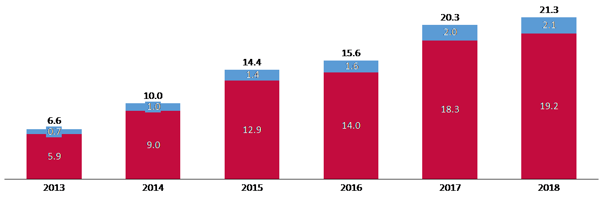
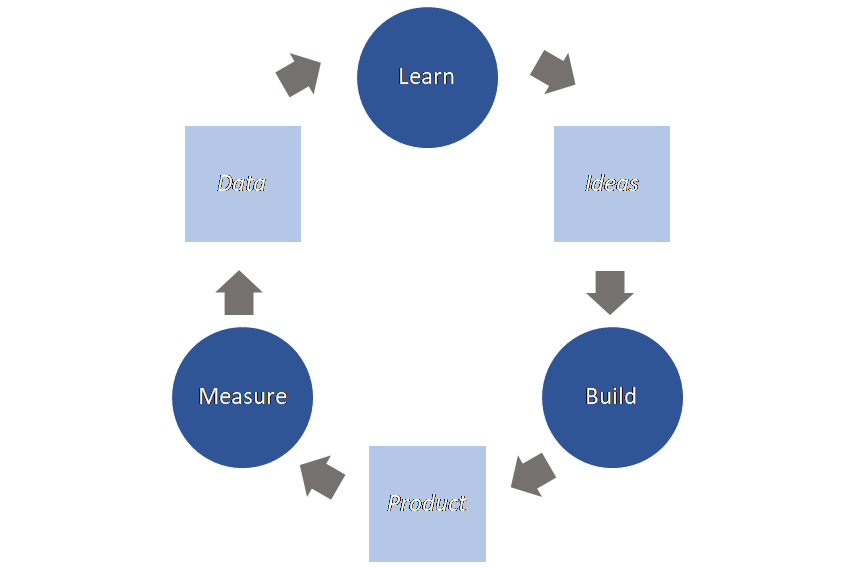

# Lean startup - How does the lean startup methodology aim to increase the success of a startup? - A brief explanation

## Abstract

Startups are a major element in today’s economy and a high number of new companies are being founded each year (Reynolds, P. D., 2016, p.446). Specifically, in the European Union, investments in startups have been increasing since 2013. As figure 1 illustrates, the venture capital investments in European startups have reached an amount of €21 billion in 2018 (Dealroom, 2019, p.7). Thus, the number of startups and small or medium sized enterprises (SME) is three times higher than large corporates in the European Un-ion (Steigertahl, L., Mauer, R., 2018, p.17).

**Figure 1: Venture capital invested in European startups, 2013-2018 (Investments in € billions)**

*Source: Own illustration, based on Dealroom, 2019, p.7; Patel, N., 2015*

However, it can be estimated that nine out of ten startups fail. To illustrate this fact in figure 1, 90% of the venture capital investments in Europe are highlighted red. Of all failures, 42% of startups are not successful because their product offering does not serve a market need. In this case, success is defined as the pure survival of the company itself as minimum (CB Insights, 2018, p.5; Griffith, E., 2014; Nobel, C., 2011, p.1; Patel, N., 2015). In general, entrepreneurs are facing an increasing uncertainty. Combined with a non-structured company management, the chance of failure becomes high (Ries, E., 2011, pp.18-19).
In order to increase the success of startups, Eric Ries has developed the lean startup idea which has been transformed into a global movement in recent years (Blank, S., 2013; Ries, E., 2011, pp.14-17, 274-277). This paper aims to briefly analyze the lean startup methodology in order to answer the following research question:

*How does the lean startup methodology aim to increase the success of a startup?*

To derive an answer, the paper is structured in four parts: After the introductory chapter, the second part explains startups in general and common reasons for failure. The third chapter can be characterized as the main part as it is about the lean startup methodology and its approach to reduce the risks of starting a company. Finally, the fourth chapter summarizes the results and assesses the research.

## Startup

### What is a startup?

According to the EU Startup Monitor, there is not only one common definition of the term startup. Nevertheless, based on conducted research, the report derives three criteria to define a startup: Company’s age, innovation level and aim to scale. Firstly, the age of a startup is not elder than five to ten years, depending on the industry. Secondly, a startup offers an innovative product, service or business model. Thirdly, a startup has the intention to grow (Steigertahl, L., Mauer, R., 2018, p.7). According to Ries, “a startup is a human institution designed to create a new product or service under conditions of extreme uncertainty.” (Ries, E., 2011, p.37)

### How to start a company in a conventional way...

The process of starting a company can be clustered in four phases: The first phase covers the intention to start a company. Secondly, a business concept is developed. The third phase is about assembling resources and creating a company. In the final phase, the company starts the exchange with the market (Van Gelderen et al., 2004, p.366). Generally, company founders often invest a lot of time in creating a business plan in the initial phase. The plan usually entails a (financial) forecast for the upcoming years with the incentive to appear attractive to potential investors. After investors could be convinced and they provide money, founders begin to develop the product and optimize it for the market launch (Blank, S., 2013).

### ... and why many of them fail.

According to CB Insights’ report which is based on an analysis of 101 startup post mortems, 42% startups fail because their product does not solve a (large enough) market problem. Companies often invest a lot in producing a product without having enough customers who are willing to buy it. Figure 2 illustrates the top ten reasons why startups fail. Some of them can be linked again with the most popular failure of market demand (CB Insights, 2018, pp.4, 5, 25; Griffith, E., 2014; Patel, N., 2015; Viki, T., 2017).

**Figure 2: Top 10 reasons why startups fail (in % of 101 startup post mortems)**

*Source: Own illustration, according to CB Insights, 2018, p.5*

## Why can the lean startup methodology help?

### Where does lean come from?

In general, lean principles aim to increase efficiency by reducing waste. The lean startup adapts the ideas of lean manufacturing which was developed by Toyota successfully in the early seventies to the context of entrepreneurship. After Ries introduced the idea in 2011, a community around this idea has been developed. For example, lean startup meetups discuss this topic globally and business schools have started to include it in their curricula (Blank, S., 2013; Mueller, R., Thoring, K., 2012, p.181; Nobel, C., 2011, pp.1-2; Rasmussen, E. S., Tanev, S., 2015, p.3; Ries, E., 2011, pp.28-29, 274-276). The methodology has been already applied by primary high-tech companies and has proven to be successful (Nobel, C., 2011, p.1). Looking ahead, Steve Blank announces in his article in Harvard Business Review that he expects also large companies to significantly benefit from following the methodology’s principles in the long term (Blank, S., 2013).

### What is a lean startup?

The lean startup method aims to teach entrepreneurs how to drive a startup (Ries, E., 2011, p.32). According to Ries, “a lean startup is a new way of looking at the development of innovative new products that emphasizes fast iteration and customer insight, a huge vision, and great ambition, all at the same time” (Ries, E., 2011, p.30). The methodology focuses on customer responsiveness to ensure that the right products meet customer demand at the right time. Thereby it criticizes that startups often focus on the productivity of creating products which customers do not want or are not willing to pay for. In conclusion, the lean startup methodology helps entrepreneurs to avoid failure (Mueller, R., Thoring, K., 2012, p.181; Ries, E., 2011, pp.30, 89-90; Viki, T., 2017).

### How do lean principles help to decrease the risk of failure?

According to Chwolka and Raith, the chance of a startups’ success increases with the quality of the planning. However, planning should not take too long in order to avoid that the company is delayed and misses the market opportunity (Chwolka, A., Raith, M., 2011, pp.8, 10).

Ries also considers plans and basic assumptions as the main and thereby as the riskiest elements of a startup. This is why a company’s hypotheses should be tested as early and regularly as possible. This paper focuses on instruments that reduce the risk of the most common reason for failure: a lack of market need (Ries, E., 2011, pp.81-82, 86).

*Build-Measure-Learn feedback loop*

Ries identifies the Build-Measure-Learn feedback loop (BML) illustrated in figure 3 as core element of the lean startup. The BML acts as a steering wheel to make constant adjustments based on learnings. Thereby Ries criticizes traditional startups creating complex and static plans based on a lot of assumptions beforehand. Consequently, Ries suggests startups to enter the first phase, build, as quickly as possible with a minimum viable product (MVP) which is described below. As a second step, customer reactions to the MVP are measured. Finally, the gathered data help to learn from customers. Based on this data, the hypotheses made in the beginning are tested. Based on metric which ideally have been defined up front, the entrepreneur may need to pivot or continue. By aiming to minimize the total time of the BML itself, a startup reduces the risk of wasting resources and inefficiency (Mueller, R., Thoring, K., 2012, p.183; Ries, E., 2011, pp.32, 91-92).

**Figure 3: Build-Measure-Learn feedback loop**

*Source: Own illustration, according to Ries, E., 2011, p.81*

*Minimum Viable Product*

A MVP is a version of a product created with a minimum amount of effort and developed time. In practice, a MVP can be a minimal landing page or an early working prototype already. Although the MVP lacks many features, it is a product created in the fastest and most efficient way to enter the BML feedback loop: The MVP is presented to early adopters in order to learn from their reactions and test the fundamental hypotheses as described above. Building a MVP also bears a risk. However, this can be evaluated as rather low in contrast to traditional product development. The latter usually takes a lot of time as it includes a thoughtful incubation phase and aims product perfection before market launch. To sum up, a MVP strives to reduce the risk of investing many resources into a product without having market potential (Mueller, R., Thoring, K., 2012, p.185; Nobel, C., 2011, p.2; Ries, E., 2011, pp.82, 96, 111).

*Pivoting*

At the end of one feedback loop, the test results may verify or falsify the hypotheses made in the beginning. In case the user feedback does not verify the hypotheses, the entrepreneur has to make a crucial decision. The decision of changing the strategic direction, for example the customer segment or key features, is called pivoting. If the data proves the hypotheses, the strategy can be preserved. Following this, lean startups may pivot faster than traditional ones and thereby reduce unnecessary time and money to finally act more resource-efficiently (Mueller, R., Thoring, K., 2012, p.186; Ries, E., 2011, pp.83, 147).

*Product-market fit*

Entrepreneurs focus on developing a product that matches the market problem. Only if they have achieved the so-called product-market-fit (PMF), they invest in scaling the company. Dan Olsen has developed the Lean Product Process which is a six-step frame-work to achieve the goal of PMF (Leibson, H., 2018; Mueller, R., Thoring, K., 2012, p.185; Nobel, C., 2011, p.1).

## How the company Dropbox started out lean.

Dropbox is a company founded in Silicon Valley and offers an easy-to-use cloud-based file-sharing tool. In its beginning, the founder Drew Houston could not demonstrate the working software because creating a prototype would have been complex and required many resources. Consequently, Houston faced the challenge that venture capitalists could not imagine Houston’s vision. Finally, he made a video as a MVP demonstrating the technology to primarily target technology early adopters. As reactions of potential customers proved the market potential, investors could be convinced. Finally, the software was built, and Dropbox became a successful company with a current market capitalization of around USD 8 billion (Bloomberg, 2019; Ries, E., 2011, pp.99-101).

## Summary

To sum up, the lean startup methodology can be described as an agile approach which aims to accelerate the product development and release. Based on customer feedback at an early stage, the market demand is tested and the product or whole company strategy can be adjusted accordingly. The lean startup idea primary addresses the most common reason for failure of startups which is the lack of market demand. By using instruments such as the Build-Measure-Learn feedback loop and connected tools like the MVP, a lean startup tries to improve the product-market-fit and consequently the success of the company.

Due to the limited scope, this paper aimed to briefly present the main idea and key principles of the lean startup methodology. An extensive analysis could cover not only the key principles themselves but also the operationalization as well as the scope of application, for example regarding various industries, in a critical and more detailed way.

# References

Blank, S. (2013). Why the Lean Start-Up Changes Everything. Retrieved 12.09.2019 from [https://hbr.org/2013/05/why-the-lean-start-up-changes-everything.](https://hbr.org/2013/05/why-the-lean-start-up-changes-everything)

Bloomberg (2019). Dropbox Inc. Company Info. Retrieved 06.10.2019 from [https://www.bloomberg.com/quote/DBX:US.](https://www.bloomberg.com/quote/DBX:US)

CB Insights (2018). The Top 20 Reasons Startups Fail. Retrieved 30.09.2019 from [https://www.cbinsights.com/research/startup-failure-reasons-top/.](https://www.cbinsights.com/research/startup-failure-reasons-top/) 

Chwolka, A., Raith, M. (2011). The value of business planning before start-up – A deci-sion-theoretical perspective. Retrieved 03.10.2019 from [http://www.dl.edi-info.ir/The%20value%20of%20business%20planning%20before%20start-up.pdf.](http://www.dl.edi-info.ir/The%20value%20of%20business%20planning%20before%20start-up.pdf) 

Dealroom (2019). 2018 full year report. Retrieved 02.10.2019 from [https://blog.deal-room.co/wp-content/uploads/2019/02/Dealroom-2018-vFINAL.pdf.](https://blog.deal-room.co/wp-content/uploads/2019/02/Dealroom-2018-vFINAL.pdf) 

Griffith, E. (2014). Why startups fail, according to their founders. Retrieved 30.09.2019 from [https://fortune.com/2014/09/25/why-startups-fail-according-to-their-founders/.](https://fortune.com/2014/09/25/why-startups-fail-according-to-their-founders/) 

Leibson, H. (2018). How To Achieve Product-Market Fit. Retrieved 30.09.2019 from [https://www.forbes.com/sites/hayleyleibson/2018/01/18/how-to-achieve-product-market-fit/#53a4b1a4476b.](https://www.forbes.com/sites/hayleyleibson/2018/01/18/how-to-achieve-product-market-fit/#53a4b1a4476b) 

Mueller, R., Thoring, K. (2012). Design thinking vs. Lean startup: a comparison of two user driven innovation strategies. Leading Innovation through design, 151-164.

Nobel, C. (2011). Teaching a ‘Lean Startup’ Strategy. Retrieved 30.09.2019 from [https://hbswk.hbs.edu/item/teaching-a-lean-startup-strategy.](https://hbswk.hbs.edu/item/teaching-a-lean-startup-strategy) 

Patel, N. (2015). 90% Of Startups Fail: Here's What You Need To Know About The 10%. Retrieved 02.10.2019 from [https://www.forbes.com/sites/neilpatel/2015/01/16/90-of-startups-will-fail-heres-what-you-need-to-know-about-the-10/#1028a56a6679.](https://www.forbes.com/sites/neilpatel/2015/01/16/90-of-startups-will-fail-heres-what-you-need-to-know-about-the-10/#1028a56a6679) 

Reynolds, P. D. (2016). Start-up Actions and Outcomes: What Entrepreneurs Do to Reach Profitability. Foundations and Trends in Entrepreneurship.12 (6), 443-559. DOI: 10.1561/0300000071.

Ries, E. (2011). The LEAN STARTUP: How Today’s Entrepreneurs Use Continuous Inno-vation to Create Radically Successful Businesses. New York: Crown Publishing Group, Random House.

Rasmussen, E. S., Tanev, S. (2015). The Emergence of the Lean Global Startup as a New Type of Firm. Technology Innovation Management Review. 5 (11), 12-19.

Steigertahl, L., Mauer, R. (2018). EU Startup Monitor. Retrieved 02.10.2019 from [http://startupmonitor.eu/EU-Startup-Monitor-2018-Report-WEB.pdf.](http://startupmonitor.eu/EU-Startup-Monitor-2018-Report-WEB.pdf) 

Van Gelderen, M., Thurik, R., Bosma, N. (2005). Success and Risk Factors in the Pre-Startup Phase. Small Business Economics. 24 (1), 365-380. DOI: 10.1007/s11187-004-6994-6.

Viki, T. (2017). Lean Startup is dead – Long live lean startup. Retrieved 30.09.2019 from [https://www.forbes.com/sites/tendayiviki/2017/03/19/lean-startup-is-dead-long-live-lean-startup/.](https://www.forbes.com/sites/tendayiviki/2017/03/19/lean-startup-is-dead-long-live-lean-startup/) 

## Concluding remarks

My professor's website:

[Ulrich Anders' Website](https://ulrich-anders.eu/) 
